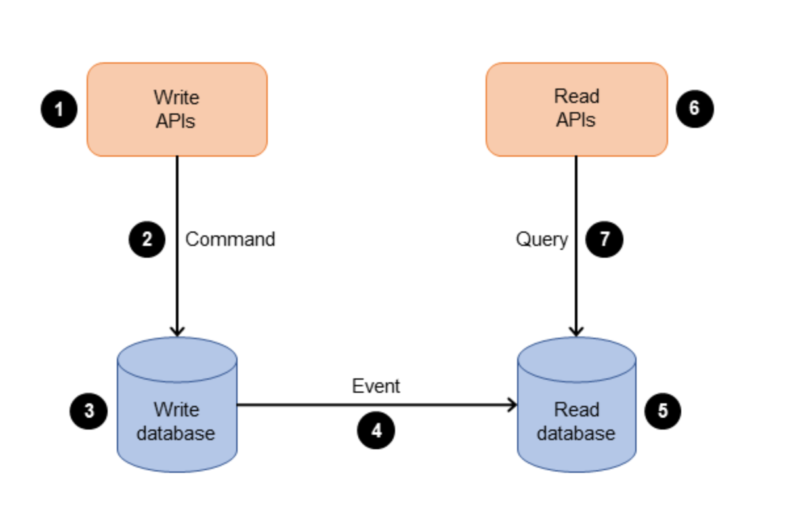

:large_blue_diamond: CQRS 패턴
-------------

> `CQRS(명령 쿼리 책임 분리)`패턴은 데이터 변형 또는 시스템의 명령 부분을 쿼리 부분과 분리한다. 
> 처리량, 지연 시간 또는 일관성에 대한 요구 사항이 서로 다른 경우 `CQRS 패턴`을 사용하여 업데이트와 쿼리를 분리할 수 있다. 
> `CQRS 패턴`은 다음 다이어그래뫄 같이 애플리케이션을 명령측관 쿼리측 두 부분으로 나눈다. 명령측은 `create`, `update`, `delete` 요청을 처리한다. 쿼리 측에서는 읽기 전용 복제본을 사용하여 `query` 부분을 실행한다.

 

이 다이어그램은 다음 프로세스를 보여준다.
1. 기업은 API를 통해 명령을 전송하여 애플리케이션과 상효 작용을 한다. 명령은 데이터 생성, 업데이트 또는 삭제와 같은 작업이다.
2. 응용 프로그램은 들어오는 명령을 명령측에서 처리한다. 여기에는 작업의 검증, 권한 부여 및 실행이 포함된다.
3. 응용 프로그램은 명령 데이터를 쓰기 (명령) 데이터베이스에 유지한다.
4. 명령이 쓰기 데이터베이스에 저장되면 읽기(쿼리) 데이터베이스의 데이터를 업데이트하는 이벤트가 트리거된다.
5. 읽기(쿼리) 데이터베이스는 데이터를 처리하고 유지한다. 읽기 데이터베이스는 특정 쿼리 요구사항에 맞게 최적화되도록 설계되었다.
6. 비지니스는 읽기 API와 상홍 작용하여 애플리케이션의 쿼리 측으로 쿼리를 보낸다.
7. 애플리케이션은 들어오는 쿼리를 쿼리 측에서 처리하고 읽은 데이터베이스에서 데이터를 검색한다.

reference: aws docs